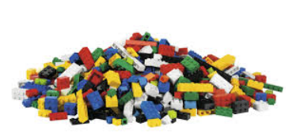
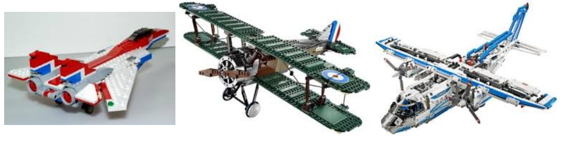
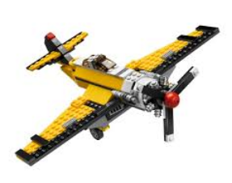
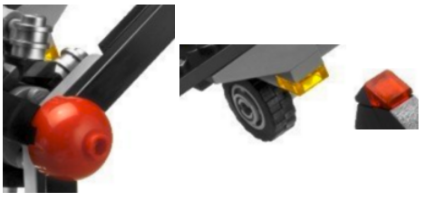
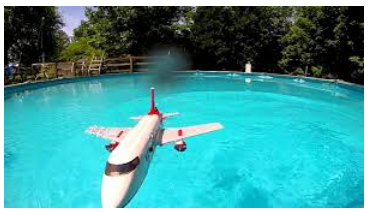

# A possible thesis structure

Overall, your reader feels most happy if she always knows what she is reading for which reason. Leave everything out that is not necessary to understand your solution.

Do not write a diary (in chronological order) BUT a linear text that motivates, analyzes and discusses your solution in the best structured way you can write it down.

* Abstract
* Introduction
* Analysis
  * Presentation of the problem domain
  * Analysis of the problem domain solution space with Identification of requirements
  * Presentation and assessment of useful building blocks
  * Summary of requirements/ Structuring of the research question into multiple sub goals
* Related Work
  * Presentation of other solutions that cover *many* of the identified requirements. (If only few requirements are met, the related work probably suits better into the Analysis section.)
* Design
  * Discussion of your design options and decisions
* Implementation
  * Selected details
* Evaluation
  * Quantitative
  * Qualitative
* Conclusion

## Abstract

* Target length ca. 0.5 pages
* Introduce the context.
* Introduce the key challenges tackled.
* Summarize your methodology.
* Main part: Summarize the key *results* of your thesis.

## Introduction

* For the very start you can ask yourself: "How would you tell your grandma what you do?"
* Which area do you do research in?
* Why is it important?
* Which methodology do you follow throughout your document?
* Give an overview on your document. What can be found where and which are the key findings there?

## Analysis (typically long)

* How does your world look like? Which kind of bricks are available and needed for your construction? (Why exactly those? Why not others?) 

* Introduce the **relevant aspects** of the problem domain you are working in.
* Introduce the base you are working on, e.g. relevant aspects of the VSL.
* Analyse the problems you tackle in your thesis. 
  * Describe and analyze the current situation, targeted goals, and resulting open challenges.
  * Identify and name concrete requirements.
* Introduce technologies and methodologies that are relevant to solve your problems.
  * Identify and present solutions for those sub problems.
  * If considered helpful for your reader consider adding a table pointing out how the state-of-the-art addresses your challenges (technique / requirement)
* Summarize your requirements (Which (sub-) questions does your thesis aim to answer?)
* **Result**: Research questions + Background/ Foundations for your design
  * The research questions should directly *follow* from your analysis texts before. Identify challenges and name them in the text as done in my thesis. Summarize your findings here.

## Related work (typically medium length)

* How did others build their solutions that cover multiple of your problems? 
   

* In analysis and related work you present existing work. The difference is that in related work you present work that answers multiple of your research questions together while in analysis you typically present work addressing single or few aspects.

* Which existing research work addresses (part of) your research questions?
* How do they solve their problems?
* Why are their solutions not sufficient?
* Provide an overview table pointing out how the related work addresses your research problems.
* **Result**: Assessment of the related work *in accordance with your research questions* (requirements) + Ideas for your design ("Others did it like that and it seems reasonable)
  * That means: Use your research questions as metric for the assessment!

## Design (typically long part)

* How and why did you end up with exactly this aeroplane? 

* Discuss in front of your reader, which challenges (those are issues linked to your research questions) you tackled in which way.
  * Present what are alternative solutions?
  * Discuss why you favor your solutions and withdraw others?
  * Explain your outcome. The final design must become crystal clear.
* Do not justify your design retrospectively. Instead, develop your design with your reader. This automatically results in a justification of your design.
* Here you show your engineering skills by arguing for and against possible solutions (building blocks from the analysis part). Show how you develop your design using computer science methodology.
* Presentation of your design. (Refer to the technologies from the analysis. Use the related work as blueprint for justifying design decisions.)
* **Result**: A discussion for your reader on how to design a solution for your research questions. The major part is a dialectic development of your solution. The presentation of your solution is also relevant, so it should become crystal clear how your final design is.

## Implementation (typically short part)

* Relevant details of the implementation

 

* Examples, details.
* **Result**: Selected details such as special frameworks used. Screenshots. Information what is implemented and what not for which reason.

## Evaluation (typically medium length)

* The evaluation should show if you met your goals, e.g. performance (latency, requests per second), usability.
* Use your statistics knowledge for obtaining significant results.
* Write a hypothesis of the outcome of each experiment *before* running it.
* Basically there are two types of evaluation:
  * Quantitatively (e.g. latency, scalability, robustness).
  * Qualitatively (e.g. usability via user study, survey)
* **Result**: Comparison to the related work, quantitative and qualitative evaluations that undermine the fulfillment of your (non-functional) requirements.

## Conclusion

* Are all issues of your problem statement solved? (This does not have to be the case but you have to address all and tell why those unsolved are unsolved.)

## Future work

* If you had more time which would be the next items to address?

Proposed writing order:
Methodology -> Analysis -> related work -> design -> implementation -> evaluation -> introduction -> conclusion -> future work -> abstract
