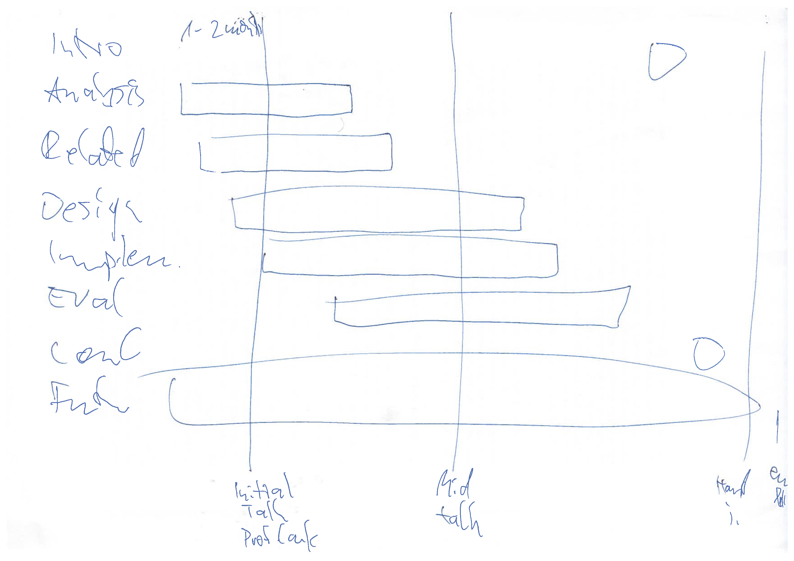
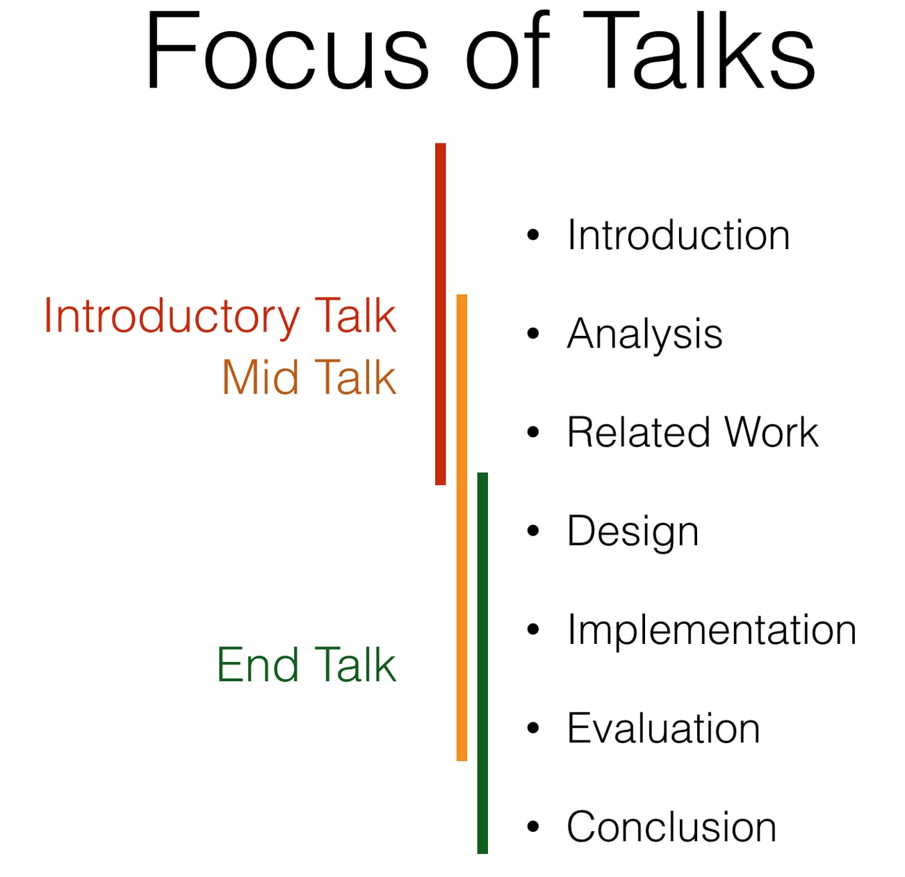

# Milestones

We have three milestones:

* Initial Talk (What do you do?)
* Mid Presentation (What are your current results and where does it go?)
* End Talk (How did you save the world?)

# Time GANTT
They are timewise distributed as follows:

# Focus of each Talk

