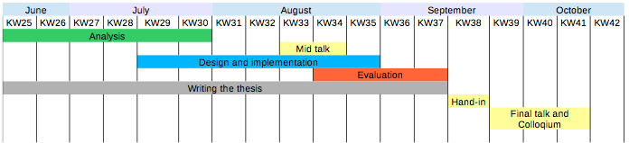

# Initial talk

The goal of the initial talk is that you show that you are able to communicate the challenges and contributions of your thesis in the light of the state of the art.
Especially I need clear statements regarding:

- What EXACTLY are you working on?
 - What exactly is the problem you tackle?
 - Which questions will your thesis answer?
 - How do you measure the quality of your contribution/ the success? (esp. quantitative measurements!)
- How do you advance the state of the art?
 - What questions are open in the state of the art and you answer them?
- What is the current state of the art regarding the major aspects of your topic?
 - How and why is it related to your work?
 - Add a summarizing text and the references.
 - How did you find it?
 - Why do you consider it exhaustive?
- How is your methodology?
- How far are you?
- Which artefacts will there be at the end of your thesis?
- What is your time plan? Add the GANTT chart!

Make sure YOU checked in the initial talk document at least three days before the initial talk.

Please back check that your documents are answering this and let us know when you think your document is ready so that we can have a look and give you feedback BEFORE the meeting with Prof. Carle.

## To become ready for the initial talk...

it makes sense to

* having done the analysis already, 
  * knowing major related work, and 
  * *knowing how your work will go beyond the state of the art*
* having made some considerations on 
    * the design of your solution, 
    * its implementation, and 
    * its evaluation.

The paper and the talk should reflect that you *know what you do* and which is your *current state*.
 
For this talk you need a document that must be sent to Prof. Carle and your advisors minimum 3 working days ahead of the talk.

## What happens at the initial talk?

We will sit with the document in Prof. Carle’s office.
He will go through the document and then he will ask you to tell him about your work based on the document in your own words.
Emerging from that there will typically be a short discussion on the topic, your methodology, and so on.

## ToDo's

* Fill out the faculties registration form (see attachment below).
* Bring the registration form and the initial talk document with you for the interview.

## What to put into the document?

You find the template in the GIT repo in the folder of your project.

The initial talk document should reflect your current understanding of your work.
It should contain the steps already completed and those planned.

The following questions should be answered. The structure can be used:

* Motivation
  * Which domain are you working in?
* Goals
  * What contribution does your work make?
  * For whom and why is the outcome relevant?
  * Which concrete problems do you want to solve/ questions do you want to answer?
  * Put your research questions/ things-to-be-solved-in-the-thesis-list here.
  * Which outcome you expect to have for each question based on your current knowledge.
* Methodology
  * How do you plan to solve the problems/ to reach the research goals?
      * What to look at in the *analysis*?
      * Which *related work* did you identify already? How do you identify more?
      * What are your current *design* ideas?
      * How do you plan to *evaluate* your solution?
* State of the Art
  * Which other solution exist for your identified challenges?
  * How do they tackle the problem?
  * Which are their solutions?
  * What do they miss that should be tackled in your work?
* Work plan
  * How is your time planning?
  * Which are the milestones? (What has to be fulfilled when to measure that you are in time?)
  * Gantt chart diagram, e.g.

  * A template suggestion is in the attached *.ods file below this wiki
* Resulting artefacts/ Key results
  * Which new things will be available after your work? (e.g. survey of..., new software component/ functionality, ...)
* References
  * Resources you cited in your work
